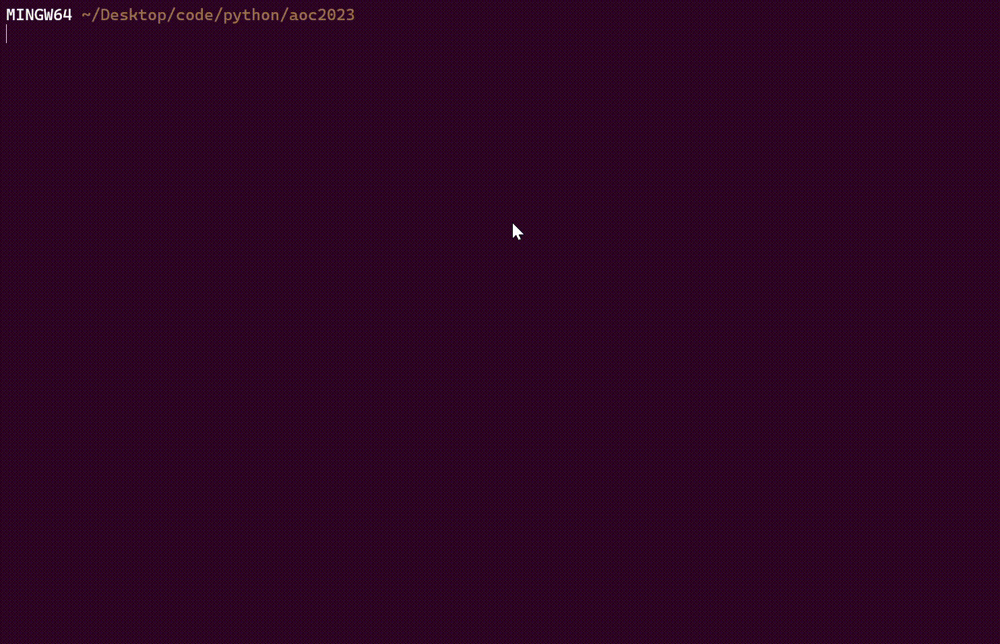
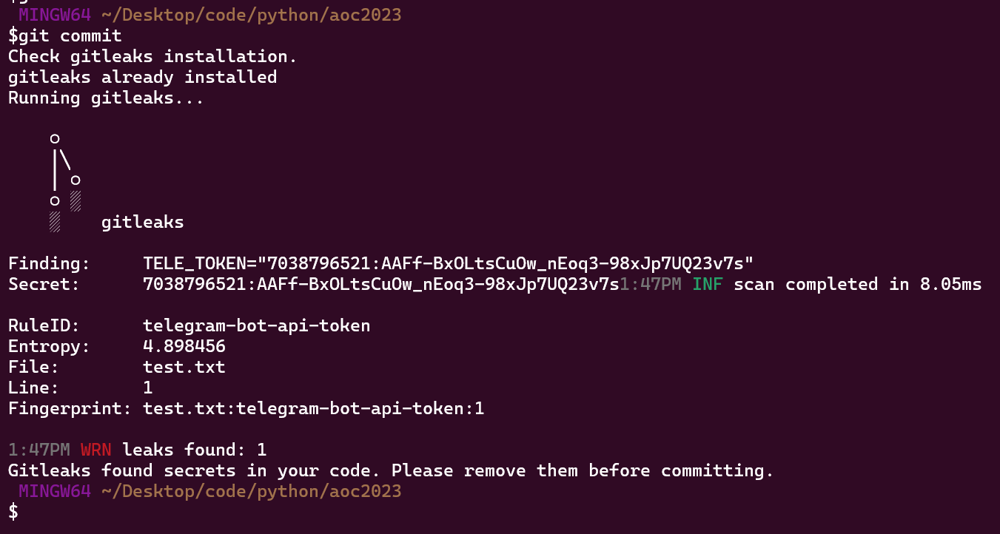

# pre-commit script that detects secrets with gitleaks and prevent commits

Installation:

```curl https://raw.githubusercontent.com/cr1m3s/precommit/main/gitleaks-precommit.sh | sh```

Execution will create pre-commit script in .git/hooks/ folder.

Supposed to work on linux, macOS and Windows.
Tested only for linux (requires curl, make, go).

Example of instalation and check:


Example of failed commit:

